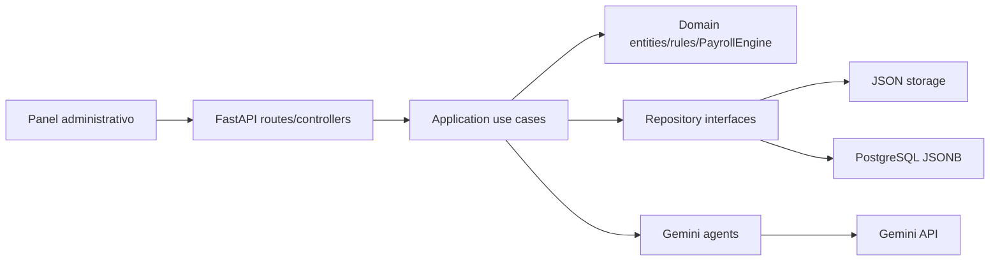
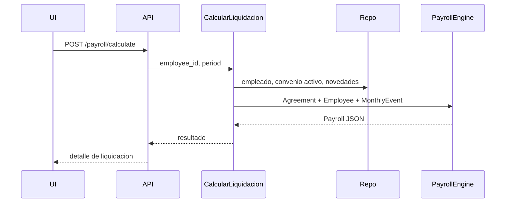
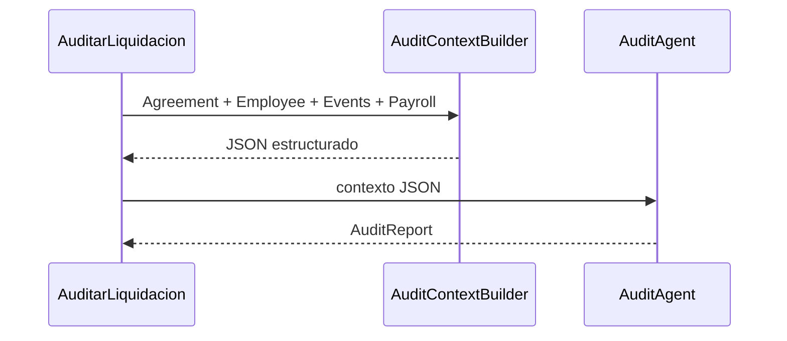

# Sistema empresarial de liquidacion de sueldos Argentina

Backend FastAPI con Clean Architecture para liquidar sueldos argentinos desde un metamodelo universal de convenios colectivos. El motor es deterministico y no contiene reglas hardcodeadas por convenio: Camioneros, Comercio, Sanidad, Avicola u otros se incorporan versionando JSON bajo `storage/convenios`.

## Arquitectura

```text
app/
├── api/
│   ├── controllers/
│   └── routes/
├── application/
│   ├── services/
│   ├── dtos/
│   ├── use_cases/
│   └── builders/
├── domain/
│   ├── entities/
│   ├── repositories/
│   ├── rules/
│   ├── value_objects/
│   └── enums/
├── infrastructure/
│   ├── ai/
│   ├── persistence/
│   ├── parsers/
│   ├── storage/
│   └── external/
├── tests/
└── shared/
```

## Capas

- `api`: recibe requests, valida DTOs, llama casos de uso y devuelve responses.
- `application`: orquesta casos de uso, servicios y builders.
- `domain`: entidades, reglas puras y `PayrollEngine`; no depende de FastAPI, Gemini ni storage.
- `infrastructure`: Gemini, parsers PDF/DOCX/Excel/TXT, storage JSON y adapter PostgreSQL.

## Arquitectura hibrida IA

- `SemanticExtractionAgent` Gemini: lee texto extraido de PDF/DOCX/Excel/TXT y devuelve solo JSON intermedio: `document_metadata`, `raw_categories`, `raw_salary_rules`, `raw_event_rules`, `raw_compliance_rules`, `ambiguities`.
- `codex_structuring_agent`: agente interno en `agents/codex_structuring_agent/` que recibe solo JSON intermedio de Gemini mediante `process(raw_gemini_json)`, construye el `Agreement`, versiona, guarda JSON, genera tests y registra logs.
- `agreement_structuring_agent`: agente interno en `agents/agreement_structuring_agent/` que recibe `{"document_metadata": {}, "full_text": "..."}` desde Gemini, analiza texto plano ya extraido, construye `Agreement`, versiona, guarda JSON, genera tests y registra logs. No lee PDFs ni documentos binarios.
- `AuditAgent` Gemini: recibe solo JSON estructurado mediante `AuditContextBuilder` y devuelve `{ "status": "...", "issues": [], "recommendations": [] }`.
- En `APP_ENV=test` o con `USE_MOCK_GEMINI=true`, se usan mocks para desarrollo y tests.

## Endpoints

- `POST /agreements/upload`
- `GET /agreements`
- `GET /agreements/{id}?version=2026_01`
- `POST /agreements/{id}/activate`
- `POST /employees`
- `POST /events`
- `POST /payroll/calculate`
- `POST /payroll/audit`

## Desarrollo local

```bash
python -m venv .venv
.venv\Scripts\activate
pip install -r requirements.txt
copy .env.example .env
uvicorn app.main:app --reload
```

Abrir `http://localhost:8000` para usar el panel administrativo.

## Docker

```bash
copy .env.example .env
docker compose up --build
```

## PostgreSQL

El adapter `PostgresRepository` usa JSONB. Crear tablas con:

```bash
psql "$DATABASE_URL" -f app/infrastructure/persistence/schema.sql
```

El contenedor DI usa JSON storage por defecto para simplificar desarrollo. Para producción, reemplazar los repositorios en `app/shared/container.py` por el adapter PostgreSQL o separar factories por ambiente.

## Tests

```bash
pytest
```

Incluye tests unitarios del motor, del `AuditContextBuilder` e integración HTTP con mocks de Gemini.

## Workflow Persistente

Convertir un JSON intermedio de Gemini al metamodelo `Agreement`:

```bash
python -m app.application.workflows.agreement_structuring_workflow raw_gemini_output.json
```

El workflow `agreement_structuring_workflow` valida el raw, ejecuta builders, guarda en `storage/convenios/{agreement_id}/{version}.json`, marca versiones anteriores como `SUPERSEDED`, genera tests en `app/tests/conventions/` y registra logs en `logs/convention_processing/`.

El agente interno tambien puede usarse desde codigo:

```python
from agents.codex_structuring_agent import CodexStructuringAgent

result = CodexStructuringAgent(repository).process(raw_gemini_json)
```

Sus logs se guardan en `logs/agents/codex/` y sus tests generados en `tests/conventions/`.

Estructurar desde texto plano extraido por Gemini:

```python
from agents.agreement_structuring_agent import AgreementStructuringAgent

result = AgreementStructuringAgent(repository).process({
    "document_metadata": {},
    "full_text": "texto completo del convenio"
})
```

## Mermaid

### Componentes



### Liquidacion



### Auditoria


